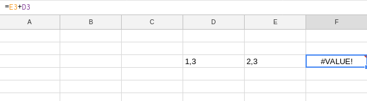

# Preguntes

# Veritable/Fals
 1. La formula **average** serveix per fer el promig
 2. Está ben escrita aquesta fórmula? 
 3. LA funció de format condicional donará un resultat depenent del valor d'un altre cella
 4. Google Spreadsheet guarda automaticament els fulls de calcul en format XLSX
 5. La formula =SUM(E3;E34) es correcta
 6. La formula =multiply(E:32) es correcta
