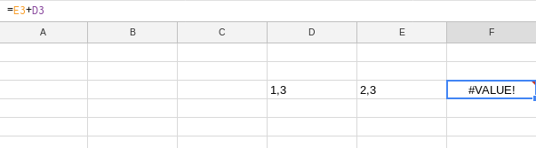

# Preguntas
www.tinyurl.com/M03-form-6NOV

## 1. Veradadero/Falso (0/10)
1. La formula **average** sirve para hacer el promedio
	- Falso 
2. Está bien escrita esta fórmula? 
	- Verdadero
3. La función de formato condicional dará un resultado dependiendo del valor de otra celda
	- Falso
4. Google Spreadsheet guarda automaticament las hojas de calculo en formato XLSX
	- Falso
5. ¿Es la formula =SUM(E3;E34) correcta?
	- Falso
6. ¿ES la formula =multiply(E:32) correcta?
	- Verdadero
7. ¿Las Columnas se identifican con letras?
	- Si
8. ¿En una celda al cambiar un valor en los datos que la generan, se actualiza automáticamente?
	- Si
9. ¿Es este el simbolo para copiar el formato?
	- Verdadero
10.

## 2. Respuesta Multiple 
1. Para comenzar una fórmula en una hoja de cálculo utilizo...
	- = **[X]**
	- :
	- ()
	- $
2. Que tipo de funciones son MAX, MIN, CONTAR, CONTARA y PROMEDIO:
	- trigonometrica
	- Financiera
	- Estadística **[X]**
	- Ninguna de las anteriores
3. ¿A cual de estos formatos no se puede exportar desde Google Spreadsheet?
	- PSD **[X]**
	- ODT
	- PDF
	- HTML
4. Que quiere decir el simbolo que hay debajo del texto?
	
	- Hay un filtro **[X]**
	- Celdas inmovilizadas
	- Los valores están ordenados
	- Hay una formúla
5. ¿Por que no funciona esta formula?
	
	- Porque para sumar se usa=SUM()
	- Falta un parentesis =(D3+E3)
	- Porque interpreta las comas de los numeros como texto
	- Porque se escribe D3+E3

## 3. Respuestas abiertas:

 1.
 2.
 3.
 4.
 5. 